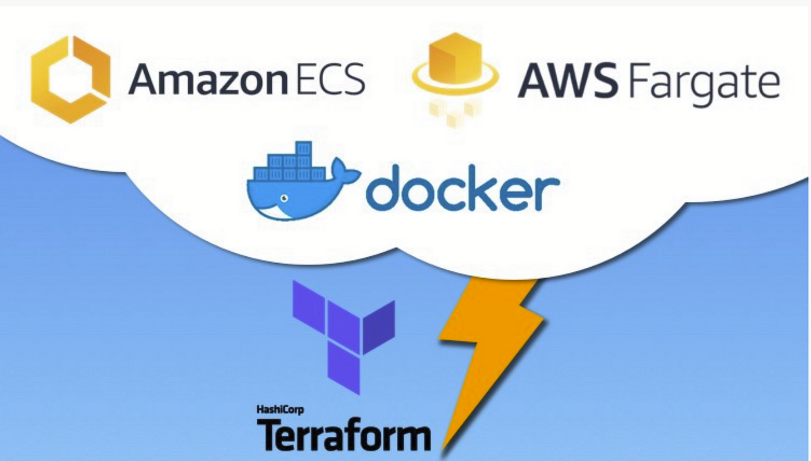

## 🚀 Projeto: Infraestrutura como Código - Terraform, Docker e Elastic Container Service

### Resumo do Projeto

Este é um projeto de Infraestrutura como Código (IaC) que utiliza Docker, Terraform para provisionamento e AWS como provedor de infraestrutura. Ele se destaca pela utilização do ECS (Elastic Container Service) da AWS, combinado com o Fargate para gerenciamento eficiente e sem servidor dos containers Docker, oferecendo uma solução robusta e escalável para aplicações.

## 🔨 Funcionalidades do Projeto

Com este projeto, você pode:

- **Criar e Gerenciar Ambientes Docker com ECS da AWS**: Configure e gerencie ambientes Docker, otimizados pelo poderoso ECS para alta disponibilidade e escalabilidade.
- **Ambientes Diferenciados**: Adapte e separe seu código em múltiplos ambientes, atendendo a diversas necessidades operacionais e de desenvolvimento.
- **Desenvolvimento Acelerado com Módulos Terraform**: Utilize módulos Terraform para agilizar a criação de infraestrutura, beneficiando-se da reutilização de código e práticas eficientes.

## ✔️ Técnicas e Tecnologias Utilizadas

Este projeto explora várias técnicas e tecnologias, incluindo:

- **Gerenciamento Automatizado de Containers Docker via ECS**: Utilização do ECS da AWS para a criação automática de máquinas e execução de containers Docker, facilitado pelo Fargate para gerenciamento sem servidor.
- **Uso de Módulos Terraform**: Implementação de módulos Terraform fornecidos por provedores e pela comunidade, visando eficiência no desenvolvimento.
- **Elastic Container Registry (ECR)**: Emprego do repositório de containers da AWS para armazenar e gerenciar imagens Docker.
- **Separação de Ambientes**: Configuração de dois ambientes separados (produção e desenvolvimento/homologação), construídos automaticamente pelo Terraform, promovendo reutilização de código e consistência.

## ⚠️ Observação Importante

Antes de iniciar o projeto, é crucial atualizar o nome da imagem Docker no arquivo `ecs.tf`, localizado na pasta `infra`. Este arquivo deve referenciar o nome da imagem que você já possui no repositório da AWS. Certifique-se de que a imagem exista no AWS ECR (Elastic Container Registry) antes de proceder com a execução do Terraform.

## 🛠️ Abrir e Rodar o Projeto

O projeto foi desenvolvido no Visual Studio Code (VSC). Para começar:

1. **Instalação**: Instale o VSC e, na aba de extensões (Ctrl+Shift+X), procure e instale a extensão "HashiCorp Terraform" para suporte de IntelliSense.
2. **Preparação do Projeto**: Se você baixou o zip, extraia-o antes de abrir. Abra a pasta do projeto no VSC.
3. **Inicialização do Terraform**: Navegue até `env/Prod` e execute `terraform init` para iniciar o Terraform.
4. **Execução do Projeto**: Para criar a infraestrutura, execute `terraform apply` na pasta `env/Prod`.